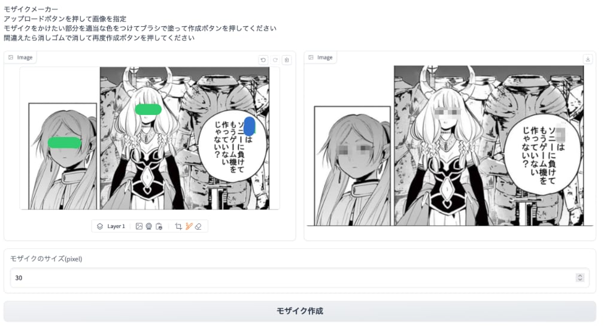

# モザイクメーカー

- Pythonを使ったモザイク生成プログラム
- gradioの習作なんで webpでしか保存できません

- インストール
  - `python -m venv venv`
  - `source venv/bin/activate`
  - `pip install -r requirements.txt`

- 実行
  - `python app.py`
  - ブラウザーから http://0.0.0.0:7862/へアクセス
  - するとこのような画面が出ます
  - 
  - 左画面の Layer 1とかいてあるすぐ右のアイコンをおして画像をアップロード
  - ブラシのアイコンを押して適当な色でモザイクを掛けたい部分に色をつける
  - 下のモザイクのサイズのところに数字を入れてしたのモザイクを作成ボタンを押す
  - すると右画面にモザイクかけた画像が生成
  - 右画面の右上のアイコンをクリックしてモザイク画像をダウンロード

- 変更履歴
  - 指定した場所を矩形モザイクから領域を自由にするよう変更した

- 改造自由
